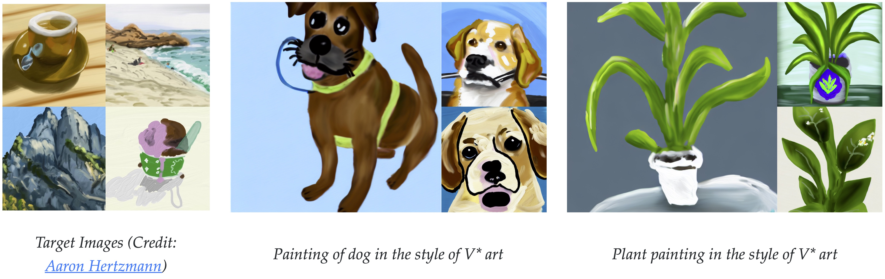
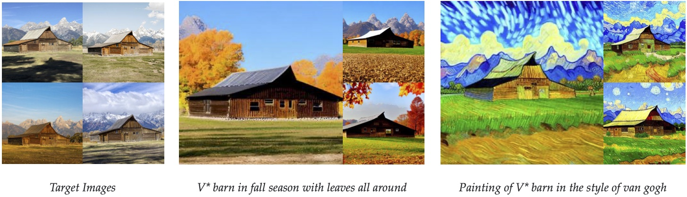
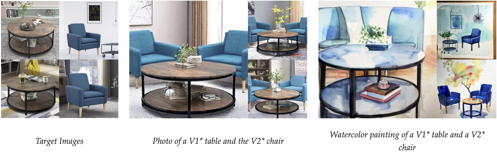
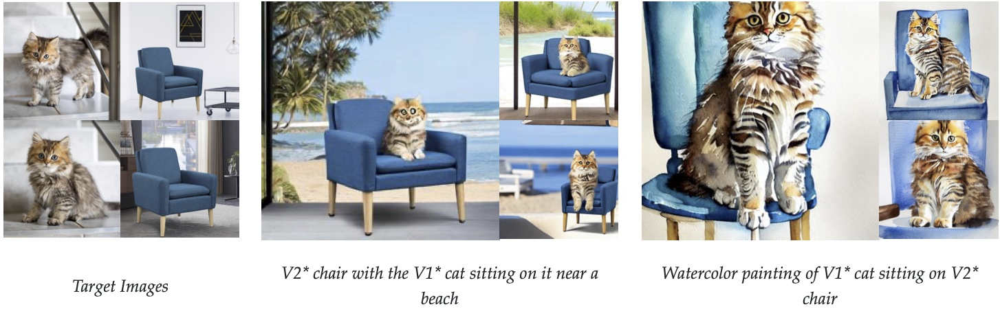
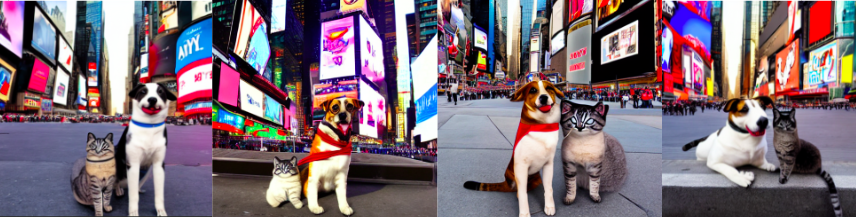

**This repo is an extension of Custom Diffusion, follow this readme for installation setup and running one basic sample example. For replicating the experiments in report, follow Experiment.MD**

### [website](https://www.cs.cmu.edu/~custom-diffusion/)  | [paper](http://arxiv.org/abs/2212.04488) | [gradio demo](https://huggingface.co/spaces/nupurkmr9/custom-diffusion)


<br>
<div class="gif">
<p align="center">

</p>
</div>

[Custom Diffusion](https://www.cs.cmu.edu/~custom-diffusion) allows you to fine-tune text-to-image diffusion models, such as [Stable Diffusion](https://github.com/CompVis/stable-diffusion), given a few images of a new concept (~4-20). Our method is fast (~6 minutes on 2 A100 GPUs) as it fine-tunes only a subset of model parameters, namely key and value projection matrices, in the cross-attention layers. This also reduces the extra storage for each additional concept to 75MB.

Our method further allows you to use a combination of multiple concepts such as new object + new artistic style, multiple new objects, and new object + new category. See [multi-concept results](#multi-concept-results) for more visual results. 

***Multi-Concept Customization of Text-to-Image Diffusion*** <br>
[Nupur Kumari](https://nupurkmr9.github.io/), [Bingliang Zhang](https://zhangbingliang2019.github.io), [Richard Zhang](https://richzhang.github.io/), [Eli Shechtman](https://research.adobe.com/person/eli-shechtman/), [Jun-Yan Zhu](https://www.cs.cmu.edu/~junyanz/)<br>
In CVPR 2023 <br>


<!-- ## Results

All our results are based on fine-tuning [stable-diffusion-v1-4](https://huggingface.co/CompVis/stable-diffusion-v-1-4-original) model.
We show results on various categories of images, including scene, pet, personal toy, and style, and with a varying number of training samples. 
For more generations and comparisons with concurrent methods, please refer to our [webpage](https://www.cs.cmu.edu/~custom-diffusion/) and [gallery](https://www.cs.cmu.edu/~custom-diffusion/results.html).


### Single-Concept Results

<div>
<p align="center">

</p>
<p align="center">

</p>
<p align="center">

</p>
<p align="center">

</p>
<p align="center">

</p>
<p align="center">

</p>
<p align="center">

</p>
<p align="center">

</p>
</div>


### Multi-Concept Results


<div>
<p align="center">

</p>
<p align="center">

</p>
<p align="center">

</p>
<p align="center">

</p>
</div>
 -->


## Method Details


<div>
<p align="center">

</p>
</div>


Given the few user-provided images of a concept, our method augments a pre-trained text-to-image diffusion model, enabling new generations of the concept in unseen contexts. 
We fine-tune a small subset of model weights, namely the key and value mapping from text to latent features in the cross-attention layers of the diffusion model. 
Our method also uses a small set of regularization images (200) to prevent overfitting. For personal categories, we add a new modifier token V* in front of the category name, e.g., V* dog. For multiple concepts, we jointly train on the dataset for the two concepts. Our method also enables the merging of two fine-tuned models using optimization. For more details, please refer to our [paper](https://arxiv.org/abs/2212.04488).  

## Getting Started

```
git clone https://github.com/adobe-research/custom-diffusion.git
cd custom-diffusion
git clone https://github.com/CompVis/stable-diffusion.git
cd stable-diffusion
conda env create -f environment.yaml
conda activate ldm
pip install clip-retrieval tqdm
```

### Training using Diffusers library

```
## install requirements 
pip install accelerate
pip install modelcards
pip install transformers==4.27.4
pip install deepspeed
pip install diffusers==0.14.0
accelerate config
export MODEL_NAME="CompVis/stable-diffusion-v1-4"
```

Our code was developed on the following commit `#21f890f9da3cfbeaba8e2ac3c425ee9e998d5229` of [stable-diffusion](https://github.com/CompVis/stable-diffusion).

Download the stable-diffusion model checkpoint
`wget https://huggingface.co/CompVis/stable-diffusion-v-1-4-original/resolve/main/sd-v1-4.ckpt`
For more details, please refer [here](https://huggingface.co/CompVis/stable-diffusion-v-1-4-original).

**Dataset:** we release some of the datasets used in paper [here](https://www.cs.cmu.edu/~custom-diffusion/assets/data.zip). 
Images taken from UnSplash are under [UnSplash LICENSE](https://unsplash.com/license). Moongate dataset can be downloaded from [here](https://github.com/odegeasslbc/FastGAN-pytorch).

**Models:** all our models can be downloaded from [here](https://www.cs.cmu.edu/~custom-diffusion/assets/models/). 


## Reproduce Single-Concept Fine-tuning with CLIP Guided Soft-Prompts

```
## download dataset
wget https://www.cs.cmu.edu/~custom-diffusion/assets/data.zip
unzip data.zip

## run training (30 GB on 2 GPUs)
bash scripts/diffusers_clip.sh 

## sample
python src/diffusers_sample.py --delta_ckpt logs/cat/delta.bin --ckpt "CompVis/stable-diffusion-v1-4" --prompt "<new1> cat playing with a ball"

```
## After running this example, follow Experiment.MD to replicate the experiments.
## Sample 10 Images
python src/diffusers_sample.py --batch_size 10 --delta_ckpt logs/cat/delta.bin --ckpt "CompVis/stable-diffusion-v1-4" --prompt "<new1> cat playing with a ball"


Current result aren't so satisfactory since the token was trained with CLIP models only that operates with much lower resolution. A better approach will be combining CLIP guidance with Stable Diffusion Fine-tuning. I will try that today The Results are given below. Given Prompt is : V* cat playing with a ball

<div>
<p align="center">
-cat-playing-with-a-ball.png' align="center" width=800>
</p>
</div>

## Reproduce Single-Concept Fine-tuning with CLIP with Stable Diffusion (Partially Trainable) Guided Soft-Prompts

```

## run training (30 GB on 2 GPUs)
bash scripts/diffusers_clip_sd.sh 

## sample
python src/diffusers_sample.py --delta_ckpt logs/clip_sd/cat_1GPU/delta.bin --ckpt "CompVis/stable-diffusion-v1-4" --prompt "<new1> cat in times square"

```

 Given Prompt is : V* cat in swimming pool

<div>
<p align="center">
-cat-in-swimming-pool.png' align="center" width=800>
</p>
</div>


## Reproduce Multi-Concept Fine-tuning with CLIP with Stable Diffusion (Partially Trainable) Guided Soft-Prompts

```

## run training (30 GB on 2 GPUs)
bash scripts/diffusers_multi_concept_clip_sd.sh 

## sample
python src/diffusers_sample.py --delta_ckpt ./logs/CustomData/cat_and_dog_clip_sd/delta.bin --ckpt "CompVis/stable-diffusion-v1-4" --prompt "<new1> cat in times square"

```
 Given Prompt is : a <X*> cat and <Y*> dog in times square

<div>
<p align="center">

</p>
</div>


## References

```
@article{kumari2022customdiffusion,
  title={Multi-Concept Customization of Text-to-Image Diffusion},
  author={Kumari, Nupur and Zhang, Bingliang and Zhang, Richard and Shechtman, Eli and Zhu, Jun-Yan},
  booktitle = {Proceedings of the IEEE/CVF Conference on Computer Vision and Pattern Recognition (CVPR)},
  year      = {2023}
}
```

## Acknowledgments
We are grateful to Nick Kolkin, David Bau, Sheng-Yu Wang, Gaurav Parmar, John Nack, and Sylvain Paris for their helpful comments and discussion, and to Allie Chang, Chen Wu, Sumith Kulal, Minguk Kang, Yotam Nitzan, and Taesung Park for proofreading the draft. We also thank Mia Tang and Aaron Hertzmann for sharing their artwork. Some of the datasets are downloaded from Unsplash. This work was partly done by Nupur Kumari during the Adobe internship. The work is partly supported by Adobe Inc. 
